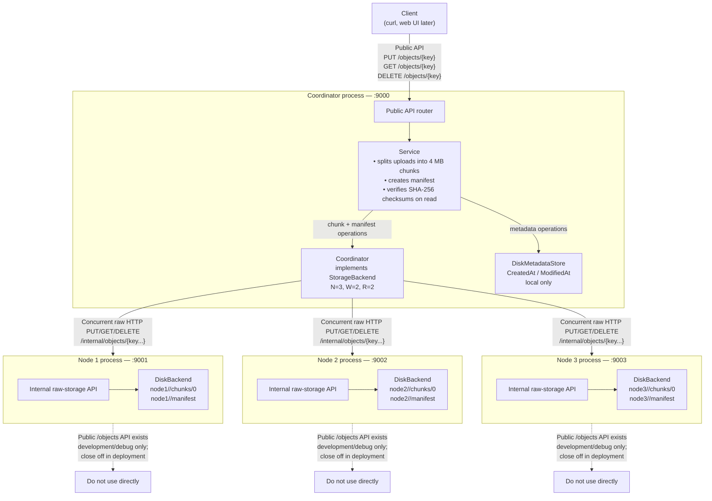

# RCloudStorage Architecture

## Current system



## Upload path

```text
Client
  → Coordinator public API
  → Service splits the file into 4 MB chunks
  → Coordinator replicates every chunk to all three nodes
  → upload succeeds after W=2 successful node acknowledgements
  → Service writes the manifest last
  → coordinator stores local CreatedAt / ModifiedAt metadata
```

The manifest makes the complete file visible only after its chunks have been
written.

## Download path

```text
Client
  → Coordinator public API
  → Service asks Coordinator for manifest/chunks
  → Coordinator queries replicas concurrently
  → returns data only when R=2 nodes return identical bytes
  → Service verifies each chunk’s SHA-256 checksum
  → reconstructed file streams back to the client
```

## Current durability boundary

```text
Replicated:
  chunks + manifest → node 1, node 2, node 3

Not yet replicated:
  CreatedAt + ModifiedAt metadata → coordinator disk only
```

A node can fail without losing a successfully quorum-written file. Coordinator
metadata replication remains future work.
