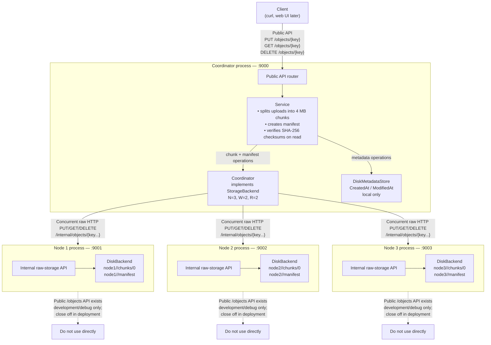

# RCloudStorage Architecture

This document describes the current architecture of RCloudStorage as of Phase 2 (local multi-process quorum replication prototype).

## Overview

RCloudStorage is a personal cloud storage system built in Go. It provides a simple HTTP API to upload, download, list, and delete files. The current architecture separates the system into distinct layers: an API router, a Service layer handling chunking and integrity, a Replication layer (Coordinator) managing distributed writes and reads, and a Storage layer (DiskBackend and MetadataStore) persisting the data locally.

## Core Components

The architecture is composed of the following key components:

### 1. API Layer
Handles HTTP requests and routing.
- **Router (`internal/api/router.go`)**: Directs HTTP requests to appropriate handlers. Exposes public endpoints (`/objects/{key}`) and internal endpoints (`/internal/objects/{key}`) used for node replication.
- **Handlers (`internal/api/handlers.go`)**: Parses requests and invokes the underlying `Service`.

### 2. Service Layer
The central logic layer (`internal/service/service.go`). It provides a unified interface (`Put`, `Get`, `Delete`, `List`) irrespective of the backend.
- **Chunking**: Large files are split into smaller chunks (currently 4 MB). This keeps memory usage low and simplifies distributed storage of large objects.
- **Manifests**: An object is represented by its chunks and a Manifest file containing the chunks' order, checksums, total size, and content type. The manifest is written only after all chunks are successfully stored.
- **Integrity**: Calculates SHA-256 checksums for each chunk during upload, and verifies them upon download.

### 3. Replication Layer (Coordinator)
Located in `internal/replication/coordinator.go`. It implements the `StorageBackend` interface, allowing the `Service` layer to seamlessly use it as a backend.
- **Dynamo-style Quorum Replication**: Data is replicated to `N` nodes. A write succeeds when `W` nodes acknowledge it, and a read succeeds when `R` nodes return identical data (with N=3, W=2, R=2 by default).
- **Concurrent Operations**: The coordinator performs HTTP requests to nodes concurrently. It returns early as soon as the quorum is met, reducing latency.

### 4. Storage Layer
The lowest level, handling actual disk persistence.
- **StorageBackend (`internal/storage/backend.go`)**: Defines the interface for putting, getting, deleting, and listing objects. Implemented by both the Replication Coordinator (distributing data) and the `DiskBackend` (storing on disk).
- **DiskBackend (`internal/storage/disk_backend.go`)**: Writes files to local disk using atomic operations (temp-file plus rename) to ensure partial writes are never visible.
- **MetadataStore (`internal/storage/metadata.go`)**: Stores small, frequently accessed object metadata like `CreatedAt` and `ModifiedAt`.

## Data Flows

### Upload Path (PUT)
1. **Client** makes a `PUT /objects/{key}` request to the Coordinator's public API.
2. **Service** receives the stream, reads it in 4 MB chunks, and computes checksums.
3. For each chunk, **Service** calls `Put` on the **Coordinator** (StorageBackend).
4. **Coordinator** concurrently sends the chunk via HTTP `PUT /internal/objects/...` to all nodes. It waits for `W` (2) nodes to acknowledge success.
5. After all chunks are stored, **Service** creates a Manifest and writes it via the **Coordinator**, following the same quorum rules.
6. Finally, **Service** writes `CreatedAt`/`ModifiedAt` metadata locally using its **MetadataStore**.

### Download Path (GET)
1. **Client** makes a `GET /objects/{key}` request to the Coordinator's public API.
2. **Service** retrieves the Manifest by querying the **Coordinator**.
3. **Coordinator** concurrently queries all nodes for the Manifest. It returns the data once `R` (2) nodes provide matching bytes (verified by SHA-256).
4. **Service** parses the Manifest, and for each chunk, queries the **Coordinator**.
5. The **Coordinator** retrieves each chunk using the `R` quorum rule.
6. **Service** verifies the SHA-256 checksum of each retrieved chunk against the Manifest.
7. The chunks are streamed back to the Client.

### Delete Path (DELETE)
1. **Client** makes a `DELETE /objects/{key}` request.
2. **Service** retrieves the Manifest to find all associated chunks.
3. For each chunk, and then the Manifest itself, **Service** issues a `Delete` to the **Coordinator**.
4. **Coordinator** concurrently sends HTTP `DELETE` to nodes, succeeding once `W` nodes acknowledge.
5. **Service** deletes the local metadata.

## Current System Diagram

## Known Limitations & Durability Boundary

Currently, the object files (chunks and manifests) are fully replicated across the storage nodes (Node 1, Node 2, Node 3). This guarantees that a node can fail without data loss for successfully quorum-written files.

**However, Metadata is not yet replicated:**
The `CreatedAt` and `ModifiedAt` values are stored in the Coordinator's local `DiskMetadataStore`. If the coordinator process loses its data directory, the metadata is lost, even though the file content (chunks and manifest) remains intact on the storage nodes. Replicating metadata to the nodes is planned for future work.
